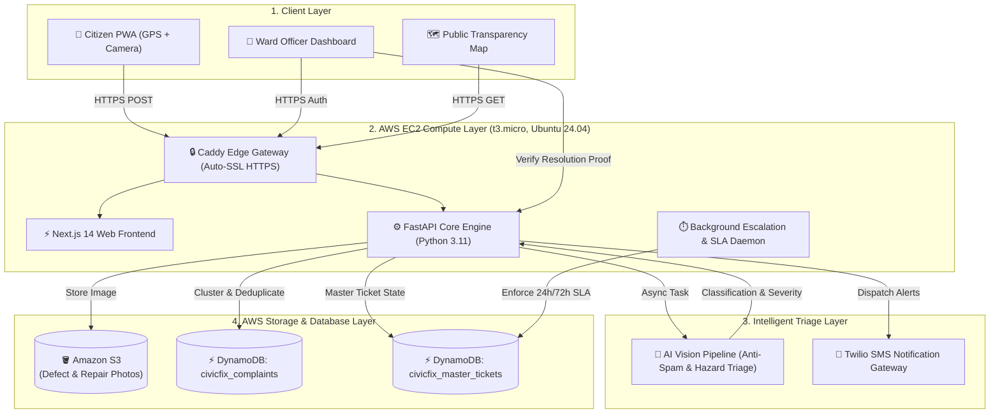

# CivicFix 🏛️
### Autonomous Civic Infrastructure Intelligence & Anti-Fraud Remediation Platform

[](https://aws.amazon.com)
[](https://aws.amazon.com/dynamodb/)
[](https://aws.amazon.com/s3/)
[](https://aws.amazon.com/ec2/)
[](https://fastapi.tiangolo.com)
[](https://nextjs.org)
[](https://www.docker.com)
[](https://opensource.org/licenses/MIT)

---

## 📌 Executive Summary

Every monsoon across Indian municipalities, critical urban infrastructure fails: dangerous potholes appear, water pipelines burst, and open drainage overflows. Despite thousands of citizen grievances filed through municipal helplines, complaints remain unresolved for months due to inter-departmental finger-pointing. Worse, millions in taxpayer funds are lost annually to **contractor invoicing fraud**, where contractors mark tickets "resolved" with simple checkboxes without performing physical repairs.

**CivicFix** re-engineers municipal governance into an autonomous, closed-loop accountability system powered by **AWS cloud infrastructure** and **computer vision**:
1. **Autonomous Spam & Defect Triage**: Computer vision rejects non-civic photos with >95% confidence and classifies hazard severity in seconds.
2. **Geospatial Spatial Clustering**: Duplicate citizen reports within proximity are unified into single Master Tickets with dynamic impact counters.
3. **Automated SLA Countdown Engine**: Real-time SLA deadlines (24h–72h) enforce accountability and automate department relay handoffs.
4. **Anti-Fraud Proof of Resolution**: Mandates geofenced before-and-after photographic evidence before tickets can be closed or public funds released.

---

## 🌐 Live Production Deployment

CivicFix is deployed live in production on AWS infrastructure with end-to-end HTTPS and sub-second latency:

| Portal / Resource | URL | Access / Credentials |
|---|---|---|
| **Citizen Grievance PWA** | [https://civicfix.duckdns.org](https://civicfix.duckdns.org) | Zero-login; 1-click camera + GPS upload |
| **Ward Officer Dashboard** | [https://civicfix.duckdns.org/ward/151](https://civicfix.duckdns.org/ward/151) | Ward: `151` / Officer Portal |
| **National Accountability Map** | [https://civicfix.duckdns.org/explore](https://civicfix.duckdns.org/explore) | Public nationwide live issue feed & analytics |
| **Interactive API Documentation** | [https://civicfix.duckdns.org/docs](https://civicfix.duckdns.org/docs) | Swagger UI / OpenAPI 3.0 specification |

---

## 🏗️ Architecture & Cloud Infrastructure

CivicFix leverages a multi-tier, highly resilient architecture natively integrated with AWS cloud services:



---

## ☁️ AWS Cloud Services Matrix

| AWS Service | Resource Name / Configuration | Purpose & Implementation |
|---|---|---|
| **Amazon DynamoDB** | `civicfix_complaints`<br>`civicfix_master_tickets` | Serverless NoSQL persistence configured with `PAY_PER_REQUEST` billing. Delivers single-digit millisecond latency for geospatial clustering queries, SLA countdown tracking, and sub-second ticket status updates with zero serverless cold-start penalties. |
| **Amazon S3** | `civicfix-images-prod-551169295110` | High-durability object storage holding raw citizen grievance evidence and contractor before-and-after resolution photos. Configured with granular public-read bucket policies for zero-latency asset delivery to web and mobile clients. |
| **Amazon EC2** | `t3.micro` (Ubuntu 24.04 LTS)<br>Region: `eu-north-1` | Hosts the live production microservices stack via Docker Compose. Handles concurrent client traffic, async computer vision background workers, and automated Caddy TLS certificate provisioning. |
| **AWS IAM** | Programmatic Service Roles | Enforces least-privilege security credentials governing access between application workers and AWS DynamoDB / S3 resources. |
| **AI / ML Integration** | Vision Pipeline Hooks | Built with modular hooks for **Amazon Bedrock (Claude 3.5 Sonnet / AWS Nova Vision)** for zero-shot defect classification, spam detection, and anti-fraud visual repair verification. |

---

## 🎯 The Accountability Loop: Core Features

### 1. Autonomous AI Vision Anti-Spam Gate
Citizens upload raw photos directly from mobile cameras. Before entering municipal queues, the vision pipeline evaluates the upload:
* **Spam Filtering**: If an upload is irrelevant (e.g., screenshots, household objects, memes), it is autonomously rejected with >95% confidence and a transparent plain-English explanation.
* **Hazard Severity & Department Tagging**: Valid defects are categorized (`Public Works`, `Sanitation`, `Water Supply`, `Electrical`) and assigned severity ratings (`Critical`, `High`, `Medium`, `Low`).

### 2. Proximity-Based Master Ticket Clustering
To eliminate queue bloating from viral road damage:
* Complaints within geographic proximity are dynamically clustered into a single **Master Ticket**.
* Each subsequent report increments the ticket's **Impact Count**, elevating its operational priority without duplicating field engineer dispatch.

### 3. Real-Time SLA Escalation & Inter-Department Relay
* Every Master Ticket is assigned a strict SLA deadline based on hazard severity (e.g., 24 hours for major road craters).
* If an issue involves multiple agencies (e.g., road subsidence caused by a broken water pipe), officers use the **Department Relay** feature. The transfer is immutably logged with audit history while preserving the original SLA countdown.

### 4. Anti-Fraud "Proof of Resolution"
Contractors and municipal workers cannot close tickets with self-reported checkboxes:
* The resolver must submit an on-site photograph of the completed repair.
* The system pairs the citizen's defect photo with the contractor's repair proof side-by-side.
* Both photos are durably archived in Amazon S3 and indexed in Amazon DynamoDB for public and administrative audit.

---

## 🛠️ Technology Stack

* **Frontend**: Next.js 14, React 18, TypeScript, Tailwind CSS, Lucide Icons
* **Backend**: FastAPI (Python 3.11), Uvicorn, Gunicorn, Pydantic v2
* **Cloud Infrastructure**: AWS SDK for Python (`boto3`), AWS CLI v2, Caddy Server, Docker Compose
* **Databases & Storage**: Amazon DynamoDB, Amazon S3
* **Telephony**: Twilio SMS API

---

## 🚀 Local Setup & Installation

### Prerequisites
* Docker & Docker Compose
* Python 3.11+
* Node.js 18+
* AWS Account with configured credentials

### 1. Clone the Repository
```bash
git clone https://github.com/code-1705/CivicFix.git
cd CivicFix
```

### 2. Configure Environment Variables
Copy and fill the environment configuration:
```bash
cp .env.example .env
```
Key environment keys:
```ini
USE_MOCK_DB=false
USE_S3=true
AWS_REGION=us-east-1
AWS_ACCESS_KEY_ID=your_aws_access_key
AWS_SECRET_ACCESS_KEY=your_aws_secret_key
DYNAMODB_TABLE_COMPLAINTS=civicfix_complaints
DYNAMODB_TABLE_MASTER_TICKETS=civicfix_master_tickets
S3_BUCKET_NAME=your-s3-bucket-name
OPENAI_API_KEY=your_vision_api_key
```

### 3. Launch via Docker Compose
```bash
docker compose up -d --build
```
Access services locally:
* **Frontend**: `http://localhost:3000`
* **Backend API**: `http://localhost:8000`
* **Swagger Docs**: `http://localhost:8000/docs`

---

## 🔒 Security & Privacy

* **Zero-Credential Exposure**: Sensitive AWS and API secrets are managed strictly through environment variables and excluded via `.gitignore`.
* **Least-Privilege Cloud Policies**: S3 bucket policies restrict write/delete capabilities to authenticated backend services, while allowing public read access exclusively for verified media keys.
* **Citizen Privacy**: Phone numbers and exact user metadata are sanitized in public audit feeds and map explorer endpoints.

---

## 📄 License
This project is licensed under the MIT License — see the [LICENSE](LICENSE) file for details.
