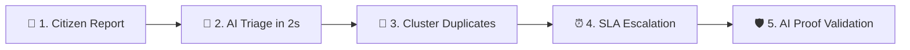

# CivicFix 🏛️
> **AI Civic Complaint System with Proof Validation**  
> Built for the **AWS First Commit Hackathon**.

[](https://fastapi.tiangolo.com)
[](https://nextjs.org)
[](https://aws.amazon.com)
[](https://www.docker.com)
[](https://opensource.org/licenses/MIT)

---

### 📌 Problem & Solution in 30 Seconds

- **Problem**: Citizen complaints sit in government queues for months. Contractors submit fake photos of distant roads to falsely mark tickets "Resolved" and take public funds.
- **Solution**: CivicFix creates an automated accountability loop:
  1. **AI Vision Triage**: Detects defects and auto-routes in 2 seconds.
  2. **Geospatial Clustering**: Auto-merges duplicate reports within 50 meters.
  3. **SLA Escalation Ladder**: Unresolved issues automatically escalate up the municipal chain of command.
  4. **Proof Validation**: Field workers must stand within 100m GPS radius. AI compares before vs. after photos. If pothole is still visible, ticket closure is blocked.

---

## ☁️ Built With AWS

- **Amazon Bedrock**: Multimodal vision AI for defect triage and before/after repair verification.
- **Amazon DynamoDB**: Fast NoSQL database storing complaints, master tickets, and SLA audit logs.
- **Amazon S3**: Tamper-proof cloud storage for citizen evidence and contractor repair photos.
- **AWS App Runner**: Auto-scaling container hosting for the FastAPI backend.
- **AWS Amplify**: Production hosting and global edge CDN for Next.js frontend.
- **Amazon SNS**: Automated SMS tracking alerts sent directly to citizens.

---

## 🕹️ Live Demo Links & Credentials

| Portal | URL | Demo Credentials |
|---|---|---|
| **Citizen App** | `http://localhost:3000` | No login needed (1-click photo + GPS) |
| **Ward Officer Portal** | `http://localhost:3000/ward/151` | Ward `151` / Password: `admin123` |
| **National Explorer** | `http://localhost:3000/explore` | Public transparency map & live feed |
| **Citizen Audit Tracker**| `http://localhost:3000/status/AFB042`| View real-time Before & After proof |

---

## 🎯 Core Features (The Accountability Loop)



### 1. Instant Vision Triage (< 2s)
AI inspects citizen photos, tags category (`Roads`, `Sanitation`, `Water`, `Electricity`), and rejects non-civic spam (selfies, memes) with polite automated reasoning.

```json
{
  "complaint_id": "AFB042",
  "is_real_issue": true,
  "department": "Public Works",
  "severity": "high",
  "confidence": 0.98,
  "description": "Severe asphalt collapse with waterlogging in driving lane."
}
```

### 2. Proximity Clustering
Reports within 50 meters of an existing defect auto-merge into one **Master Ticket**, incrementing an **Impact Counter** so engineers tackle the most disruptive problems first.

### 3. 🚨 SLA Escalation Ladder
Every ticket has a strict SLA countdown. When deadlines breach, accountability escalates automatically:
- **Level 1 (0–100% SLA)**: Assigned to local Ward Officer.
- **Level 2 (100% SLA Breach)**: Escalated to Assistant Executive Engineer.
- **Level 3 (150% SLA Breach)**: Escalated to Zonal Commissioner.
- **Level 4 (Critical Delay)**: Escalated directly to Municipal Commissioner.

### 4. Anti-Fraud Proof of Resolution
Contractors cannot close tickets with a button click:
1. **100m GPS Lock**: Officer must be physically present at the repair site.
2. **AI Comparison**: Officer uploads fix photo. AI vision inspects original defect vs repair proof. If damage remains, **closure is rejected**.

```json
{
  "master_ticket_id": "MT-A175F5",
  "status": "resolved",
  "geofence_verified": true,
  "ai_verification": {
    "defect_eliminated": true,
    "confidence": 0.97
  }
}
```

### 5. Inter-Department Relay
If a road cavity reveals a ruptured water pipe, ward officers can forward the ticket to **BWSSB Water** or **BESCOM Power** with a single click, logging a permanent audit trail.

---

## 📸 Application Preview

| Citizen Reporting Portal | Ward Officer Dashboard |
|:---:|:---:|
| 📱 **1-Click Geo-Reporting**<br>Auto-captures GPS, accepts up to 5 photos, instant SMS receipt. | 👷 **SLA Urgency & Clustering**<br>Sorted by breach deadline, citizen impact count, and 1-tap relay. |

| Anti-Fraud Verification | National Transparency Map |
|:---:|:---:|
| 🛡️ **Before vs After Proof**<br>Side-by-side evidence comparing citizen report against contractor fix. | 🗺️ **Live India Geospatial Map**<br>Clustered pins, search, department filters, 100% real DB data. |

---

## 🚀 Run in 30 Seconds

### Option A: Docker (Recommended)
```bash
docker compose up --build
```
- Frontend: `http://localhost:3000`
- Backend API Docs: `http://localhost:8000/docs`

### Option B: Local Setup

**Backend**:
```bash
cd backend
python -m venv venv
# Windows: .\venv\Scripts\activate | Linux: source venv/bin/activate
pip install -r requirements.txt
cp .env.example .env
uvicorn main:app --reload --port 8000
```

**Frontend**:
```bash
cd ../frontend
npm install
cp .env.example .env.local
npm run dev
```

---

## ☁️ AWS Production Deployment

### Backend on AWS App Runner
```bash
aws ecr get-login-password --region us-east-1 | docker login --username AWS --password-stdin <ACCOUNT_ID>.dkr.ecr.us-east-1.amazonaws.com
docker build -t civicfix-backend ./backend
docker tag civicfix-backend:latest <ACCOUNT_ID>.dkr.ecr.us-east-1.amazonaws.com/civicfix-backend:latest
docker push <ACCOUNT_ID>.dkr.ecr.us-east-1.amazonaws.com/civicfix-backend:latest
```

### Frontend on AWS Amplify
1. Connect GitHub repo `code-1705/CivicFix` to AWS Amplify.
2. Build command: `npm run build`.
3. Set environment variable: `NEXT_PUBLIC_API_BASE_URL=https://<app-runner-url>.awsapprunner.com`.

---

## ⚙️ Environment Variables Reference

| Variable | Service | Description | Default |
|---|---|---|---|
| `USE_MOCK_AI` | Backend | Bypass vision AI for local tests | `false` |
| `USE_MOCK_DB` | Backend | Local JSON store vs Amazon DynamoDB | `true` |
| `USE_S3` | Backend | Upload evidence directly to Amazon S3 | `false` |
| `S3_BUCKET_NAME` | AWS S3 | Target Amazon S3 bucket name | `""` |
| `AWS_REGION` | AWS | Target AWS deployment region | `us-east-1` |
| `OPENAI_API_KEY` | Bedrock / AI | Multimodal vision API key | Required |
| `JWT_SECRET_KEY` | Security | Officer JWT token secret | Required |
| `NEXT_PUBLIC_API_BASE_URL` | Frontend | Base URL of FastAPI backend | `http://localhost:8000` |

---

## 🛡️ License
MIT License. Built for the **AWS First Commit Hackathon**.
