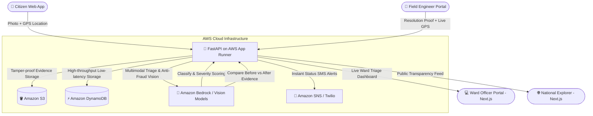

# CivicFix 🏛️
> **Autonomous Civic Issue Triage & Anti-Fraud Municipal Resolution Engine**  
> Built for the **AWS First Commit Hackathon**.

[](https://github.com/code-1705/CivicFix/actions)
[](https://fastapi.tiangolo.com)
[](https://nextjs.org)
[](https://aws.amazon.com)
[](https://www.docker.com)
[](https://opensource.org/licenses/MIT)

---

## 📌 Executive Summary

Municipal grievance redressal systems in India (e.g., Sahayata, BBMP Sahaaya, Swachhata) suffer from crippling systemic failures:
1. **Manual Bureaucracy**: Complaints sit in central triage queues for weeks before manual dispatchers figure out the appropriate department and municipal ward.
2. **Citizen Spam & Duplicate Noise**: A single prominent road crater generates 50 duplicate reports, overwhelming field engineers.
3. **Ghost Resolutions & Contractor Fraud**: Contractors regularly mark tickets as "Resolved" by uploading unrelated photos, distant roads, or stock images to falsely draw taxpayer funds without performing physical repairs.

**CivicFix** eliminates the human middleman. It is an autonomous, cloud-native civic resolution engine that pairs **Multimodal Vision AI** with **GPS Geofencing** and **Automated Dispatch** to ensure zero-delay routing and mathematically fraud-proof ticket closure.

---

## 💡 Core Innovations & Features

### 1. ⚡ Instant Vision AI Triage (< 2s)
- Citizens capture a photo of potholes, water leaks, open manholes, or overflowing garbage.
- Multimodal Vision AI detects hazard severity, classifies the municipal department, and rejects non-civic spam (memes, selfies, private property) with clear automated reasoning.

### 2. 📍 Proximity Deduplication & Impact Clustering
- Uses spatial proximity algorithms to cluster complaints occurring within 50 meters of existing master tickets.
- Automatically increments an **Impact Counter** so ward engineers prioritize issues affecting the most citizens.

### 3. 🛡️ Anti-Fraud Geofenced Resolution Engine
- Ward officers and field contractors cannot close a ticket by simply clicking "Done".
- Field workers **must be physically present within 100 meters** of the verified problem GPS coordinates.
- Field workers **must upload proof photos of the completed fix**.
- The AI vision engine directly compares the **Before** and **After** photos. If the defect is still present or if a fake image is detected, **the system automatically rejects the resolution and leaves the ticket open**.

### 4. 🔄 Inter-Department Relay Engine
- If a road repair defect turns out to have an underlying burst water pipe or severed electrical cable, ward officers can forward/relay the ticket to the respective agency (e.g., BWSSB Water Board, BESCOM Electrical).
- Maintains a permanent, tamper-evident **Handover Audit Trail** with timestamps, officer IDs, and technical crew notes.

### 5. 🗺️ National Transparency Explorer (`/explore`)
- Public-facing transparency portal with interactive geospatial map and paginated card feed.
- Live city/department filters and real-time KPI counters computed 100% directly from verified database records with **zero hallucinated or hardcoded metrics**.

---

## 🏗️ Architecture & AWS Cloud-Native Stack



### AWS Cloud Services Breakdown
| AWS Service | Architecture Role |
|---|---|
| **AWS App Runner** | Containerized, auto-scaling deployment for the FastAPI application layer with built-in health checks and TLS termination. |
| **Amazon S3** | Object storage with strict IAM access controls for citizen evidence photos and contractor repair verification proofs. |
| **Amazon DynamoDB** | Ultra-low latency NoSQL key-value store housing complaints, clustered master tickets, and officer authentication audit logs. |
| **Amazon Bedrock / Vision** | Foundation model inference for multimodal image analysis, automated department categorization, and before/after defect verification. |
| **Amazon SNS** | Managed message dispatch delivering automated SMS alerts directly to citizens when their issue is triaged or verified fixed. |

---

## 🧭 System User Flows

### Citizen Flow
1. Open CivicFix on mobile browser (no app install needed).
2. Take/upload photo (GPS captured automatically from browser).
3. (Optional) Provide mobile number to receive tracking SMS.
4. AI validates image:
   - **Valid Civic Hazard**: Automatically assigned to nearest Ward and queued for resolution.
   - **Invalid / Spam**: Instantly closed with transparent AI explanation.
5. Citizen receives direct link to live **Before/After Audit Page** (`/status/[complaint_id]`).

### Ward Officer & Contractor Flow
1. Officer logs in to designated Ward Portal (`/ward/[wardNo]`).
2. Dashboard displays open tickets sorted by SLA urgency and citizen impact count.
3. Field crew navigates to GPS location using integrated Google Maps pin.
4. Upon completing repairs, officer clicks **Resolve**, standing at the location.
5. Officer uploads proof photo -> AI compares with original damage -> ticket resolved.

---

## 🚀 Quick Start (Local Development)

### Prerequisites
- Node.js 20+
- Python 3.11+
- Git

### 1. Clone the repository
```bash
git clone https://github.com/code-1705/CivicFix.git
cd CivicFix
```

### 2. Backend Setup
```bash
cd backend
python -m venv venv

# Windows:
.\venv\Scripts\activate
# Linux/macOS:
source venv/bin/activate

pip install -r requirements.txt
cp .env.example .env
uvicorn main:app --reload --port 8000
```
- API Docs: `http://localhost:8000/docs`
- Health Check: `http://localhost:8000/health`

### 3. Frontend Setup
```bash
cd ../frontend
npm install
cp .env.example .env.local
npm run dev
```
- Web Application: `http://localhost:3000`
- National Explorer: `http://localhost:3000/explore`
- Ward Dashboard: `http://localhost:3000/ward/151` *(Demo login: Ward 151 / `admin123`)*

---

## 🐳 Docker Deployment (Production Multi-Container)

Run the full stack with one command:
```bash
docker compose up --build
```
- Frontend: `http://localhost:3000`
- Backend: `http://localhost:8000`
- Healthcheck: `http://localhost:8000/health`

---

## ☁️ Deployment Guide to AWS

### Deploy Backend to AWS App Runner
1. Authenticate Docker with Amazon ECR:
   ```bash
   aws ecr get-login-password --region us-east-1 | docker login --username AWS --password-stdin <ACCOUNT_ID>.dkr.ecr.us-east-1.amazonaws.com
   ```
2. Build and push backend image:
   ```bash
   docker build -t civicfix-backend ./backend
   docker tag civicfix-backend:latest <ACCOUNT_ID>.dkr.ecr.us-east-1.amazonaws.com/civicfix-backend:latest
   docker push <ACCOUNT_ID>.dkr.ecr.us-east-1.amazonaws.com/civicfix-backend:latest
   ```
3. In AWS Console, create an **App Runner Service** using the ECR image URI and configure environment variables from `backend/.env.example`.

### Deploy Frontend to AWS Amplify Hosting
1. Connect GitHub repository to **AWS Amplify Console**.
2. Select branch `main`.
3. Set build settings:
   ```yaml
   frontend:
     phases:
       build:
         commands:
           - npm ci
           - npm run build
   ```
4. Configure environment variable:
   `NEXT_PUBLIC_API_BASE_URL=https://<your-app-runner-service>.awsapprunner.com`

---

## ⚙️ Environment Variables Reference

### Backend (`backend/.env`)
| Variable | Description | Default |
|---|---|---|
| `USE_MOCK_AI` | Bypass external AI calls for offline testing | `false` |
| `USE_MOCK_DB` | Local file store vs real DynamoDB tables | `true` |
| `USE_S3` | Upload evidence images directly to Amazon S3 | `false` |
| `S3_BUCKET_NAME` | Target Amazon S3 bucket name | `""` |
| `AWS_REGION` | Target AWS region | `us-east-1` |
| `OPENAI_API_KEY` | Vision LLM API key | `""` |
| `JWT_SECRET_KEY` | Secret key for officer JWT authentication tokens | Required |

### Frontend (`frontend/.env.local`)
| Variable | Description | Default |
|---|---|---|
| `NEXT_PUBLIC_API_BASE_URL` | Base URL of FastAPI backend service | `http://localhost:8000` |

---

## 🛡️ License
Distributed under the MIT License. Built with pride for the AWS First Commit Hackathon.
