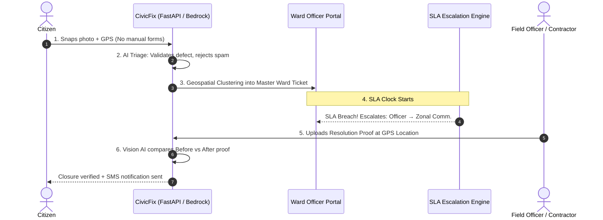
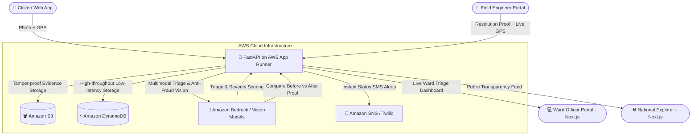

# CivicFix 🏛️
> **AI-Powered Civic Accountability System with Anti-Fraud Proof Validation**  
> Built for the **AWS First Commit Hackathon**.

[](https://fastapi.tiangolo.com)
[](https://nextjs.org)
[](https://aws.amazon.com)
[](https://www.docker.com)
[](https://opensource.org/licenses/MIT)

---

### ⚡ At a Glance
- **Problem**: Citizen complaints rot for weeks in manual queues, while repair contractors upload fake photos to falsely close tickets and pocket municipal funds.
- **Solution**: An autonomous closed-loop accountability engine. Vision AI triages complaints, clusters nearby duplicates, escalates SLA breaches up the administrative ladder, and mathematically blocks ticket closure without verified before/after physical repair proof.
- **Live Demo Portals**:
  - 📱 **Citizen Reporting App**: `/`
  - 👷 **Ward Officer Dashboard**: `/ward/151` *(Demo: Ward `151` / `admin123`)*
  - 🗺️ **National Transparency Explorer**: `/explore`
  - 🔍 **Live Audit & Tracker**: `/status/[id]`

---

## ☁️ Built With AWS

- **Amazon Bedrock**: Multimodal vision models for defect triage, severity scoring, and anti-fraud before-and-after photo verification.
- **Amazon DynamoDB**: Low-latency NoSQL database storing complaints, clustered master tickets, and SLA timers.
- **Amazon S3**: Tamper-proof cloud object storage for geo-tagged citizen evidence and resolution proofs.
- **AWS App Runner**: Fully managed, auto-scaling container service running the FastAPI backend.
- **AWS Amplify**: Production hosting and edge CDN for the Next.js frontend.
- **Amazon SNS / Cognito**: Instant SMS citizen notifications and role-based officer authentication.

---

## 🎯 The Accountability Loop: 5-Step Demo Walkthrough



### Step 1: Zero-Friction Citizen Filing
Citizen opens the web app on any mobile browser. With one click, the photo and GPS coordinates are captured automatically. No tedious registration or multi-page bureaucratic forms.

### Step 2: Instant AI Vision Triage & Spam Filter
**Amazon Bedrock / Vision** inspects the evidence in under 2 seconds:
- **Valid hazard**: Categorizes the issue (`Roads`, `Sanitation`, `Water`, `Electricity`) and calculates urgency tier (1–4).
- **Spam / Invalid**: Random selfies, memes, or private property photos are auto-closed with polite AI reasoning sent back to the citizen.

```json
{
  "complaint_id": "AFB042",
  "is_real_issue": true,
  "department": "Public Works",
  "severity": "high",
  "confidence": 0.98,
  "description": "Severe asphalt collapse with waterlogging in driving lane."
}
```

### Step 3: Geospatial Clustering (Deduplication)
Multiple citizens reporting the same pothole within a 50-meter radius are automatically grouped into a single **Master Ticket**. Instead of 50 redundant tasks, the ward dashboard shows one ticket with an **Impact Count** reflecting citizen urgency.

### Step 4: SLA Escalation Ladder
Every ticket has an automated countdown timer. If field crews fail to resolve it within SLA:
- **Level 1 (0–100% time)**: Assigned to local Ward Officer.
- **Level 2 (100% SLA Breach)**: Automatically escalates to Ward Executive Engineer.
- **Level 3 (150% SLA Breach)**: Escalates to Zonal Commissioner & Municipal Commissioner.

### Step 5: Anti-Fraud Proof of Resolution
Contractors cannot close tickets by clicking a button.
1. **100m GPS Lockdown**: Officer must be physically at the repair site.
2. **AI Vision Verification**: Officer uploads resolution photos. The AI directly compares the original hazard with the repair photo. If the defect is still present, **the system rejects closure and flags the contractor**.

```json
{
  "master_ticket_id": "MT-A175F5",
  "status": "resolved",
  "geofence_verified": true,
  "ai_verification": {
    "defect_eliminated": true,
    "asphalt_repaired": true,
    "confidence": 0.97
  }
}
```

---

## 🏗️ Architecture Diagram



---

## 🔄 Inter-Department Relay Engine

When a road defect uncovers an underlying ruptured water line or severed underground cable:
- Ward officers can relay tickets between agencies (`Roads & Infrastructure`, `BWSSB Water & Drainage`, `BESCOM Electrical`, `Solid Waste Management`).
- Creates an indelible **Handover Audit Log** (`from_department → to_department`, officer ID, timestamp, handover notes).

---

## 🗺️ National Transparency Portal (`/explore`)

- **Interactive Geospatial Map**: Clustered status markers (Green = Verified Fixed, Red = Active Hazard).
- **Zero Mock Data**: Dynamic metrics computed 100% live from verified database records.
- **Live Search & Filter**: Filter by city, municipal department, and SLA status with paginated card views.

---

## 🚀 Quick Start (Run Locally)

### 1. Clone Repository
```bash
git clone https://github.com/code-1705/CivicFix.git
cd CivicFix
```

### 2. Run with Docker (Recommended)
```bash
docker compose up --build
```
- Frontend: `http://localhost:3000`
- Backend API Docs: `http://localhost:8000/docs`
- Healthcheck: `http://localhost:8000/health`

### 3. Manual Local Setup

**Backend**:
```bash
cd backend
python -m venv venv
# Windows: .\venv\Scripts\activate | Linux/macOS: source venv/bin/activate
pip install -r requirements.txt
cp .env.example .env
uvicorn main:app --reload --port 8000
```

**Frontend**:
```bash
cd ../frontend
npm install
cp .env.example .env.local
npm run dev
```

---

## ☁️ AWS Production Deployment

### Backend on AWS App Runner
```bash
aws ecr get-login-password --region us-east-1 | docker login --username AWS --password-stdin <ACCOUNT_ID>.dkr.ecr.us-east-1.amazonaws.com
docker build -t civicfix-backend ./backend
docker tag civicfix-backend:latest <ACCOUNT_ID>.dkr.ecr.us-east-1.amazonaws.com/civicfix-backend:latest
docker push <ACCOUNT_ID>.dkr.ecr.us-east-1.amazonaws.com/civicfix-backend:latest
```
*Point AWS App Runner service to this ECR URI with environment variables from `backend/.env.example`.*

### Frontend on AWS Amplify
1. Connect GitHub repo `code-1705/CivicFix` to AWS Amplify Console.
2. Set build command to `npm run build`.
3. Set environment variable: `NEXT_PUBLIC_API_BASE_URL=https://<your-app-runner-url>.awsapprunner.com`.

---

## ⚙️ Environment Variables Reference

| Variable | Description | Default |
|---|---|---|
| `USE_MOCK_AI` | Bypass external vision AI for local dev | `false` |
| `USE_MOCK_DB` | Local store vs Amazon DynamoDB | `true` |
| `USE_S3` | Upload images directly to Amazon S3 | `false` |
| `S3_BUCKET_NAME` | Target Amazon S3 bucket name | `""` |
| `AWS_REGION` | AWS region | `us-east-1` |
| `OPENAI_API_KEY` | Vision LLM API key | Required |
| `JWT_SECRET_KEY` | Secret key for officer JWT authentication | Required |
| `NEXT_PUBLIC_API_BASE_URL` | Base URL of backend service | `http://localhost:8000` |

---

## 🛡️ License
MIT License. Built for the **AWS First Commit Hackathon**.
