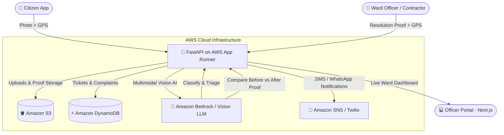

# CivicFix 🏛️
> **Autonomous Civic Issue Triage & Anti-Fraud Municipal Resolution Engine**  
> Built for the AWS First Commit Hackathon.

[](https://github.com)
[](https://fastapi.tiangolo.com)
[](https://nextjs.org)
[](https://aws.amazon.com)
[](https://www.docker.com)

---

## 📌 Problem Statement

Municipal governance in Indian cities faces three catastrophic bottlenecks:
1. **Manual Bureaucracy**: Citizen complaints sit in grievance queues for weeks before a human dispatcher forwards them to the right ward.
2. **Duplicate Spam**: A single pothole generates 50 redundant complaints, overwhelming ward staff.
3. **Contractor Fraud**: Repair contractors frequently upload fake photos or photos of distant roads to falsely mark tickets as "Resolved" and claim municipal funds.

---

## 💡 The Solution

**CivicFix** eliminates the human middleman through an autonomous pipeline:
1. **Instant Vision Triage**: AI vision analyzes damage severity, categorizes the issue (Pothole, Garbage, Streetlight, Water Leakage), and auto-routes directly to the responsible ward engineer in under 2 seconds.
2. **Geo-Deduplication**: Automatically clusters nearby reports using GPS proximity to prevent duplicate tickets while tracking community impact.
3. **Anti-Fraud Proof Verification**: Ward officers and contractors cannot resolve tickets by clicking a button. They must stand within 100 meters of the problem GPS coordinates and upload photo proof. AI vision inspects the before-and-after proof to verify true physical repair.
4. **Inter-Department Relay Engine**: Officers can re-route misclassified tickets across municipal departments (Roads, BWSSB Water, BESCOM Electrical, Sanitation) with full audit trail logging.
5. **National Transparency Explorer (`/explore`)**: Mobile and desktop public feed + interactive geospatial map showing live civic resolutions across Indian cities with 0% mock data.
6. **Transparent Citizen Notifications**: Citizens receive immediate tracking SMS/WhatsApp alerts upon filing and automated verification upon genuine fix.

---

## 🏗️ Architecture & AWS Cloud-Native Stack



### AWS Services Utilized
| AWS Service | Production Role |
|---|---|
| **AWS App Runner** | Fully managed container execution for auto-scaling FastAPI backend |
| **Amazon S3** | Secure, tamper-proof cloud object storage for citizen evidence & repair proof photos |
| **Amazon DynamoDB** | Ultra-low latency NoSQL database storing complaints and master ward tickets |
| **Amazon Bedrock / Vision** | AI triage, categorization, severity scoring, and anti-fraud before/after comparison |
| **Amazon SNS** | Automated SMS and push notification delivery to citizens on ticket status updates |

---

## 🚀 Quick Start (Local Development)

### Prerequisites
- Node.js 20+
- Python 3.11+
- Git

### 1. Clone the repository
```bash
git clone https://github.com/your-username/civicfix.git
cd civicfix
```

### 2. Run Backend
```bash
cd backend
python -m venv venv
# Windows:
.\venv\Scripts\activate
# Linux/macOS:
source venv/bin/activate

pip install -r requirements.txt
cp .env.example .env
uvicorn main:app --reload --port 8000
```
*Backend runs on `http://localhost:8000` with Swagger docs at `http://localhost:8000/docs`.*

### 3. Run Frontend
```bash
cd ../frontend
npm install
cp .env.example .env.local
npm run dev
```
*Frontend runs on `http://localhost:3000`.*

---

## 🐳 Docker Deployment (Production-Ready)

Run the entire stack with a single command:
```bash
docker compose up --build
```
- Frontend: `http://localhost:3000`
- Backend: `http://localhost:8000`
- Healthcheck: `http://localhost:8000/health`

---

## ☁️ Deployment Guide to AWS

### Deploy Backend to AWS App Runner
1. Build and push container to **Amazon ECR**:
   ```bash
   aws ecr get-login-password --region us-east-1 | docker login --username AWS --password-stdin <ACCOUNT_ID>.dkr.ecr.us-east-1.amazonaws.com
   docker build -t civicfix-backend ./backend
   docker tag civicfix-backend:latest <ACCOUNT_ID>.dkr.ecr.us-east-1.amazonaws.com/civicfix-backend:latest
   docker push <ACCOUNT_ID>.dkr.ecr.us-east-1.amazonaws.com/civicfix-backend:latest
   ```
2. In AWS Console, create an **App Runner** service pointing to the ECR image.
3. Set environment variables from `backend/.env.example`.

### Deploy Frontend to AWS Amplify / Vercel
1. Connect GitHub repository to **AWS Amplify Hosting**.
2. Set build command: `npm run build`
3. Set environment variable:
   `NEXT_PUBLIC_API_BASE_URL=https://<your-app-runner-url>.awsapprunner.com`

---

## ⚙️ Environment Variables Reference

### Backend (`backend/.env`)
| Variable | Description | Default |
|---|---|---|
| `USE_MOCK_AI` | Bypass external AI calls for offline testing | `false` |
| `USE_MOCK_DB` | Use local JSON store vs real DynamoDB | `true` |
| `USE_S3` | Upload images directly to S3 vs local disk | `false` |
| `S3_BUCKET_NAME` | Target Amazon S3 bucket name | `""` |
| `AWS_REGION` | AWS target region | `us-east-1` |
| `OPENAI_API_KEY` | Vision LLM API key | `""` |
| `JWT_SECRET_KEY` | Secret key for officer JWT authentication | Required |

### Frontend (`frontend/.env.local`)
| Variable | Description | Default |
|---|---|---|
| `NEXT_PUBLIC_API_BASE_URL` | Base URL of FastAPI backend | `http://localhost:8000` |

---

## 🛡️ License
MIT License. Built for the AWS First Commit Hackathon.
